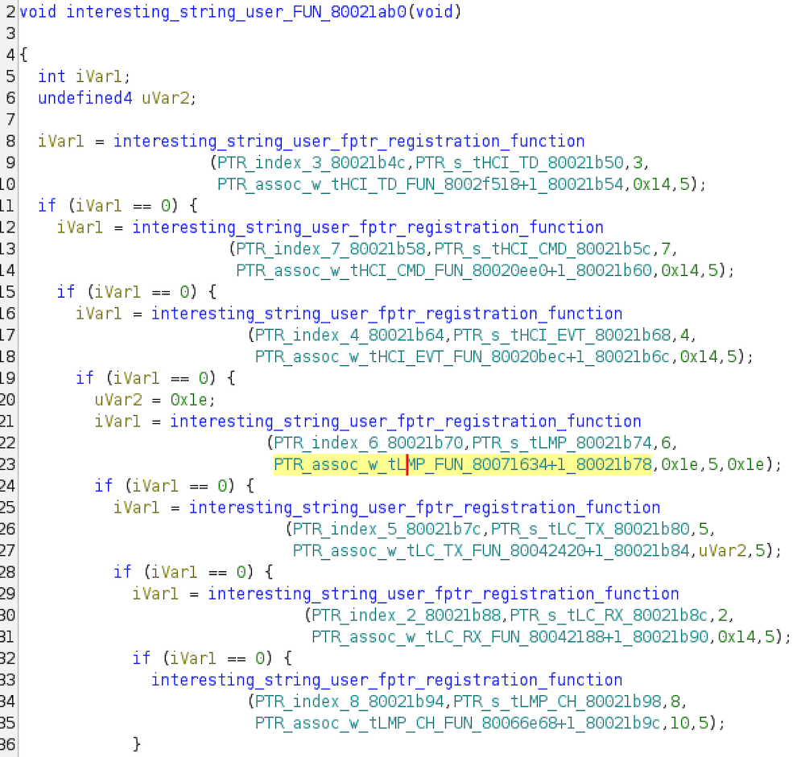
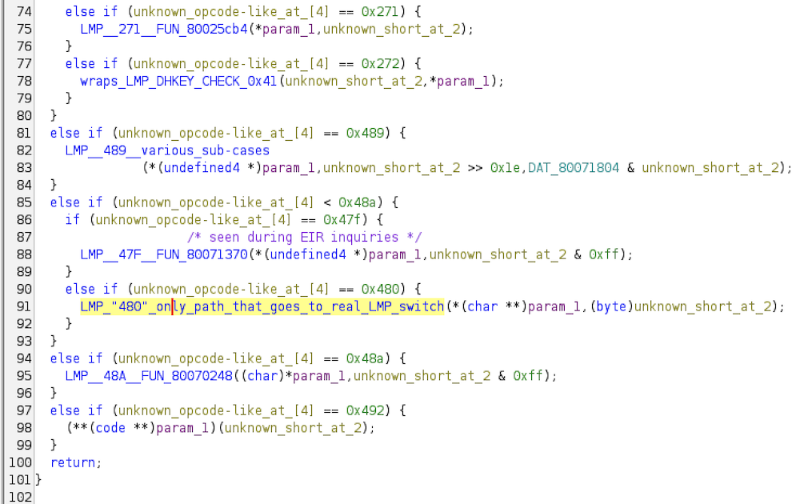
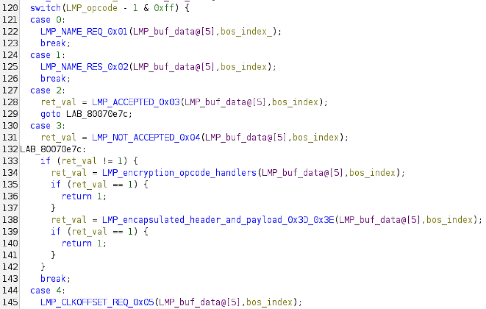
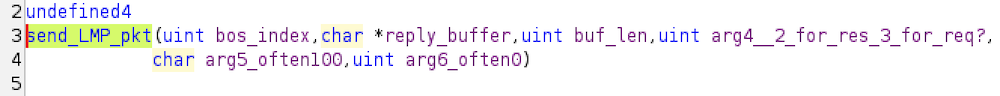
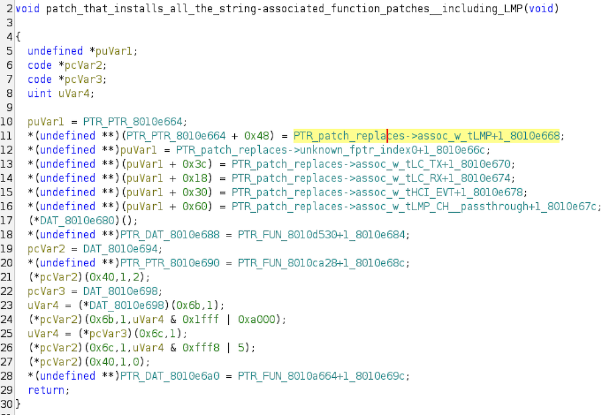
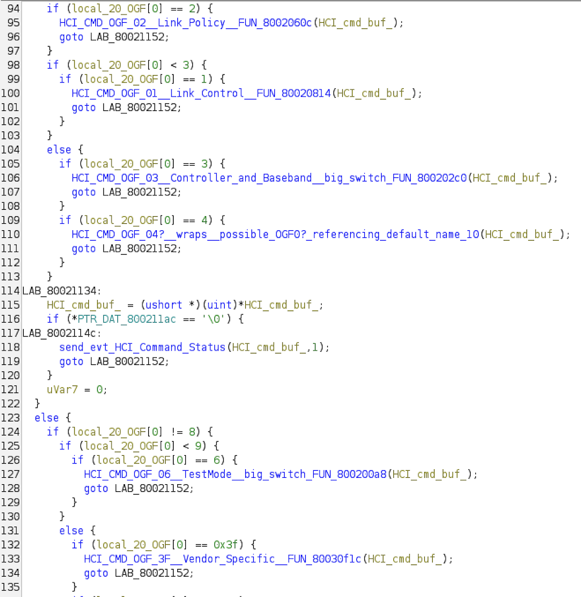
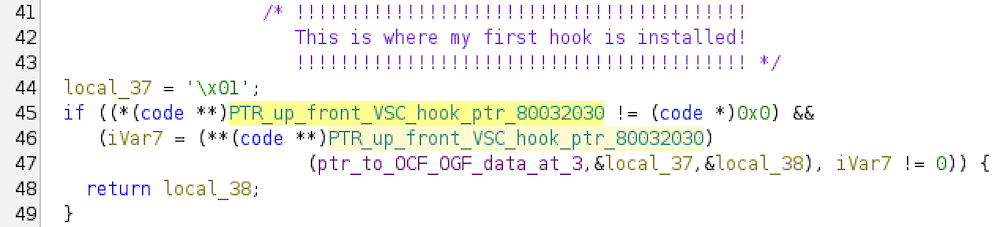
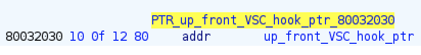
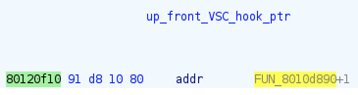

# What are these?

* **`2025-10-05_rtl8761btv_UART_fw-and-ROM.bin.gzf`** - Ghidra-exported file for `rtl8761b_fw.bin` (for UART-interface chips) which was shipped with Ubuntu 24.04. Additionally includes the chip's ROM & RAM dumped through memory-reading Vendor-Specific Commands (VSCs).
* **`2025-10-05_rtl8761buv_USB_fw-and-ROM.bin.gzf`** - Ghidra-exported file for `rtl8761bu_fw.bin` (for USB-interface chips) which was shipped with Ubuntu 24.04. Additionally includes the chip's ROM & RAM dumped through memory-reading VSCs.

These files were exported from a [Ghidra 11.4.1](https://github.com/NationalSecurityAgency/ghidra/releases/tag/Ghidra_11.4.1_build) project. Therefore you may need that version of newer to import them. (I don't know what the compatibility requirements are for these files.)

# Importing .gzf files

Open Ghidra.

`Menu Bar -> File -> New Project`

Make non-shared project. Name it `RTL8761B_Xeno_Analysis`.

In the new project go to `Menu Bar -> File -> Import File` (or press `i`) and select `2025-10-05_rtl8761btv_UART_fw-and-ROM.bin.gzf` and then hit "OK" twice. Then do the same for `2025-10-05_rtl8761buv_USB_fw-and-ROM.bin.gzf`. 

# UART vs. USB file

It's important to note that the majority of the reverse engineering was initially done on the UART firmware+ROM file ([`2025-10-05_rtl8761btv_UART_fw-and-ROM.bin.gzf`](./2025-10-05_rtl8761btv_UART_fw-and-ROM.bin.gzf)), using the RTL861BTV dev board. Only later after it was clear that the work needed to proceed on the USB dongles, was analysis switched over to the USB firmware+ROM file ([`2025-10-05_rtl8761buv_USB_fw-and-ROM.bin.gzf`](./2025-10-05_rtl8761buv_USB_fw-and-ROM.bin.gzf)). This was required because the offsets within the firmwares where the initial hook is placed, are different.

The impact of this switch of files is that some analysis is done in one file but not the other. I tried to do a basic moving over of function names and comments and the like, using Ghidra's "Version Tracking" mechanism when I first moved over to the USB file. However not everything was copied over.

Therefore in practice you may need to consult both files to get a fuller picture of the chip's function.

## Naming conventions

"bos" = "big-ol'-struct" - There is an array of 12 large structs beginning at `0x8012dc50` ("bos array"). These structs are almost certainly to do with holding state information for a maximum of 12 connection handles worth of connections. (As a simple test of this theory, I did multiple connections via the a given chip, and I found the returned connection handle number resets after 12.) A better name would perhaps be "connection struct", but I didn't feel like renaming.

"bosi" = "bos index" - i.e. which index out of the bos array is selected by some code. A better name would perhaps be "connection index", but I didn't feel like renaming.

## Functions of particular interest for this research

(Note: at the time of writing, decompilation is not possible on ARM-based systems. Therefore it is recommended to use Ghidra on an Intel-based system, to take advantage of decompilation.)

### Starting-point

* 0x80021ab0 - `interesting_string_user_FUN_80021ab0()` - There are only a handful of strings used in the code, but they're *interesting* strings, such as `"tLMP"`, `"tHCI_CMD"`, `"tHCI_EVT"`, etc, which are suggestive of their Bluetooth purpose. `interesting_string_user_FUN_80021ab0()` performs some sort of registration of likely callback functions on a per-string basis. It turns out that one of the things patches do is re-register their own handlers for these cases (which may be substantive, or merely pass-through.)

### LMP-related

* 0x80021ab0 - `assoc_w_tLMP_FUN_80071634()` - This is the function associated with the "tLMP" string. This function checks an unknown opcode-like value at the beginning of a buffer, in a switch-like manner. But we only are interested in the path where that value is 0x480, in which case it proceeds to `LMP_"480"_only_path_that_goes_to_real_LMP_switch()`.

* 0x80070c04 - `LMP_"480"_only_path_that_goes_to_real_LMP_switch()` - This function contains a switch statement, with the value being checked clearly being equal to the LMP opcode minus one.

* 0x800611e4 - `send_LMP_pkt()` - By looking into the per-opcode functions, we can see that in general LMP-sending functions inevitably call to `send_LMP_pkt()`. Therefore this is also the function which is used by my [patch-modifying code](../custom_patch_src_asm/RTL8761B_patch_modification.asm) to send custom LMP packets. Arguments 4, 5, and 6 are not fully understood, but values of "2", "100", "0" seemed to work for my purposes so far.

* 0x8010e27c - `patch_that_calls_patch_that_calls_main_LMP_func_possible_callback_override()` - Great name, right? :P This is code included in the USB-specific patch firmware. It is specifically code which registers the patches' own handlers for things like the LMP callback function.
* ***This function is important, because it's where I insert one of my two hooks!***
* My "hook-installation" code (`_start_install_fptrs`) overwrites the memory address 0x8012aed4 ("`patch_target_2`" in [`RTL8761B_patch_modification.asm`](../custom_patch_src_asm/RTL8761B_patch_modification.asm)), with a pointer to `_installed_fptr_2` which is what's responsible for checking if an incoming LMP packet should be logged or not. A key point is that because the patches overwrite their own pointer into 0x8012aed4, we have to install our pointer after theirs is installed, both so they don't smash ours, and so we can call through to theirs after we're done.
* Note: you are recommended to look at the UART-file version of this function as it's names are filled in more than the USB-file version. (So I'm using the UART version in the screenshot below. Which has a different name and address, since they're different patches.)

### HCI-related

* 0x80020ee0 - `assoc_w_tHCI_CMD_FUN_80020ee0()` - This is the function indirectly registered in `interesting_string_user_FUN_80021ab0()` associated with `"tHCI_CMD"`. It can be seen to be calling sub-functions based on the Opcode Group Field (OGF).

* 80030f1c - `HCI_CMD_OGF_3F__Vendor_Specific__FUN_80030f1c()` - This function is also clearly checking for some of Realtek's VSCs. When viewed in 16-bit form, VSCs always form constants like 0xFCXX, 0xFDXX, or 0xFEXX (due to how the OGF/OCF 6/10-bit split works with OGF always == 0x3F.) This function is checking for constants like 0xFC20, which is the known public Realtek patch download VSC. In this way this function gives a hint of what other VSCs are supported, as well as a peek into the code that implements them.
* ***However, this function is most important, because it's where I insert one of my two hooks!***
* My "hook-installation" code (`_start_install_fptrs`) overwrites the memory address 0x80120f10 ("`patch_target_1`" in [`RTL8761B_patch_modification.asm`](../custom_patch_src_asm/RTL8761B_patch_modification.asm)), which a patch has updated to point at its own function at 0x8010d891 in the below screenshot), to point at my own function ("`_installed_fptr_1`" in [`RTL8761B_patch_modification.asm`](../custom_patch_src_asm/RTL8761B_patch_modification.asm).) The fact that `HCI_CMD_OGF_3F__Vendor_Specific__FUN_80030f1c()` calls this function essentially immediately, means that I gain code execution before any other VSC processing is done. This provides an opportunity to create my own "XENO_VSC" (OCF 0x222) to send in a buffer of data to send out with `send_LMP_pkt()`.

---

You can find more functions of interest in the bookmarks, by searching for the categories of "misc", "LMP", HCI_CMDS"

---
Copyright 2025 Dark Mentor LLC - [https://darkmentor.com](https://darkmentor.com)