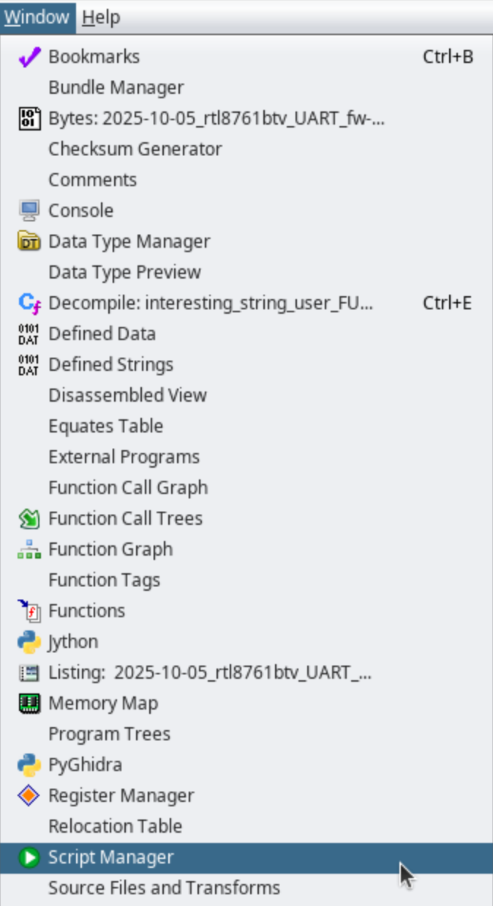
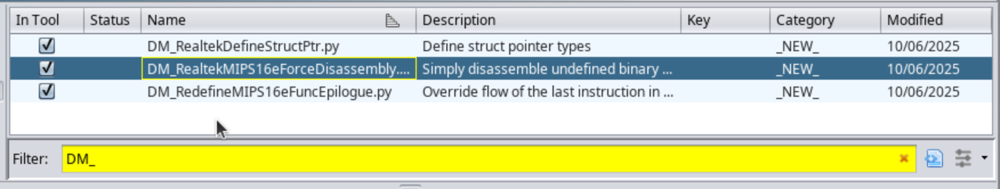
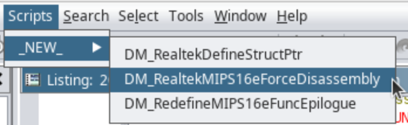

# What are these?

These are scripts which can be used in Ghidra to improve disassembly & decompilation results when looking at RTL8761B\*-based patches & ROM.

All scripts have a `START_ADDR` and `END_ADDR` which need to be specified to define the memory range over which they will operate.

* **`RealtekSimpleDisassembler.py`** - This is the most important script. By default, Ghidra doesn't properly handle the typical MIPS16e function, which has code followed by data. Ghidra doesn't resume disassembly after the last of the data referenced within a function. This script forces MIPS16e disassembly at each new undefined binary location with the start-end range, which allows it to pick up new functions after previous functions.
* **`RedefineMIPS16eFuncEpilogue.py`** - This loops through a range of memory and corrects the reference to the final jump-to-register `jr` instruction, which is really jumping to the return address, so that Ghidra treats it like it's a return from the function (so it stops thinking there's a jump table at the end of functions that it just can't recover.)
* **`RealtekDefineStructPtr.py`** - This loops through a range of memory and finds references to the structs given in the STRUCT_INFO array, which is an array of tuples. The first field of the tuple is the address of the base of the struct. And the second field is the name in the Ghidra project of the struct definition.

# Usage

All scripts were tested only with Ghidra 11.4.0 & [11.4.1](https://github.com/NationalSecurityAgency/ghidra/releases/tag/Ghidra_11.4.1_build).

Scripts must be copied into the appropriate Ghidra folder to be visible. E.g. if the main Ghidra code is in `~/Downloads/ghidra_11.4.1_PUBLIC` then the files would need to be copied to `~/Downloads/ghidra_11.4.1_PUBLIC/Ghidra/Features/Base/ghidra_scripts/`.

Restart Ghidra after copying the scripts, and then go to `Menu Bar -> Window -> Script Manager`:   

Once there, filter the script names with "DM_":  

Then check all the boxes to enable these scripts.

Now restart Ghidra.

The scripts can now be run via `Menu Bar -> Scripts -> _NEW_ -> <script name>`: 

As a reminder though, you may need to adjust the `START_ADDR` and `END_ADDR` within the scripts before running. (You'll need to go understand the [research](https://darkmentor.com/publication/2025-11-hardweario/) to understand likely ranges over which you might want to run each script.)

---
Copyright 2025 Dark Mentor LLC - [https://darkmentor.com](https://darkmentor.com)